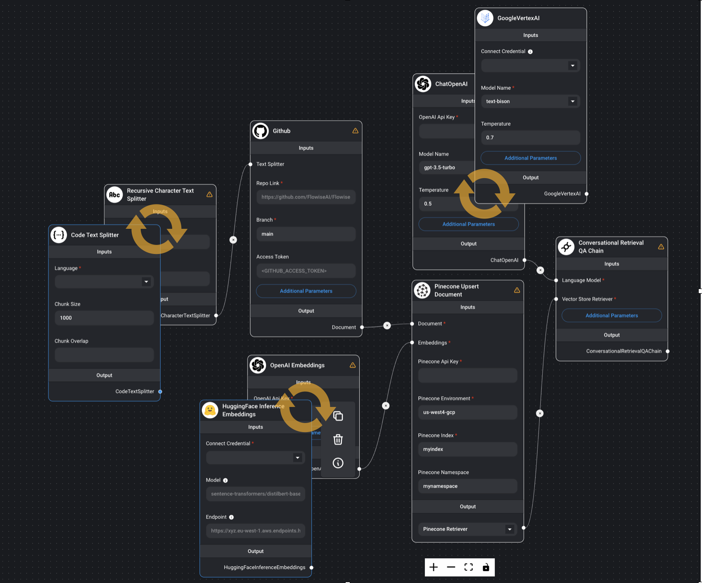

# LLMFlowOptimizer (WIP)


## 📌  Introduction

In recent years, various LLMs, embedding models, and LLM flows utilizing them have been proposed, making it difficult to manually verify which flow or component is optimal.

This repository aims to treat LLMs and Embeddings as a hyperparameter, with the goal of automatically searching for the optimal hyperparameter of the LLM flow.

**Below image is the concept image of this repository (image from [Flowise](https://github.com/FlowiseAI/Flowise)). Component of LangChain like a LLM or Embedding can be treated as hyperparameter. You can find optimal component from various candidate.**


This repository is strongly inspired by [lightning-hydra-template](https://github.com/ashleve/lightning-hydra-template)🎉

## 🔧  Main Technologies

- [LangChain](https://github.com/langchain-ai/langchain) : LangChain is a framework for developing applications powered by large language models. It can be divided conceptually into components (like llm component, embedding component), which are well-abstracted and easy to switch. This is the reason we can treat each component as hyperparameter.

- [Hydra](https://github.com/facebookresearch/hydra) : Hydra is an open-source Python framework that simplifies the development of research and other complex applications. It has the ability to dynamically create a hierarchical configuration system, which is its key feature

- [Optuna](https://github.com/optuna/optuna) : Optuna is an open-source Python library for hyperparameter optimization. It offers a define-by-run API that allows users to construct search spaces, a mixture of efficient searching, and pruning algorithm to enhance the cost-effectiveness of optimization. Optuna also provides a web dashboard for visualization and evaluation of studies in real-time.

- [ragas](https://github.com/explodinggradients/ragas) : Ragas is an evaluation framework for Retrieval Augmented Generation (RAG) pipelines that provides tools based on the latest research for evaluating LLM-generated text to give insights about the RAG pipeline.

# How to use

please clone this repository and install requirements.

```bash
git clone git@github.com:Yongtae723/LLMFlowOptimizer.git
cd llmflowoptimizer
```

## setup

We use poetry for package management. you can install poetry and python packages by following command.

```bash
pip install poetry
poetry install
```

## define model architect and config.

1. Define model architect like [llmflowoptimizer/modelsample_qa.py](llmflowoptimizer/model/sample_qa.py).

   The arguments in `__init__()` can be used as hyperparameter and will be able to be optimized.

2. Define model config on [configs/model](configs/model) like example.

   Example model config:

   ```yaml
   defaults: # you can use yaml file on this directly.
   - _self_
   - embedding: OpenAI
   - text_splitter: RecursiveCharacter
   - llm_for_answer: ChatOpenAI

   _target_: llmflowoptimizer.models.sample_qa.SampleQA # what we defined on llmflowoptimizer/models/sample_qa.py

   data_path: ${paths.reference_data_dir}/nyc_wikipedia.txt
   ```

3. then you can check your model and config by following command.

```bash
poetry run python llmflowoptimizer/run.py extras.evaluation=false extras.print_config=true
```

## define evaluation system

1. Define evaluation system like [llmflowoptimizer/model/evaluation.py](llmflowoptimizer/model/evaluation.py), and set argument on [configs/evaluation](configs/model).

   Optuna will optimize component based on the return value of this evaluation system.

2. You can check your evaluation system by following command.

```bash
poetry run python llmflowoptimizer/run.py
```

## override

You can modify components simply by adding commands, without needing to alter the code.

### override single parameter

When you want to change single parameter, you have to use `.` between parameter name.
Example:

```bash
poetry run python llmflowoptimizer/run.py model.llm_for_answer.model_name="gpt-4"
```

By doing this, you change `model_name` parameter of `llm_for_answer` to gpt-4.

### override component parameter

when you want to change parameter in component scale, you have to define component in the same folder use `/` between parameter name and value.

```bash
poetry run python llmflowoptimizer/run.py model/llm_for_answer=OpenAI
```

By doing this, LLM flow use [`OpenAI.yaml`](configs/model/llm_for_answer/OpenAI.yaml) model instead of [`ChatOpenAI.yaml`](configs/model/llm_for_answer/ChatOpenAI.yaml) model.

### Experiment config

you can also save experimental config on [configs/experiment](configs/experiment).

after you save config [configs/experiment](configs/experiment), you can override like below.

```bash
poetry run python llmflowoptimizer/run.py experiment=example
```

## Hyperparameter search

WIP

## managing experimental results

WIP
maybe use langflow?

## Appendix

### Auto code formatting

If you want auto code formatting, you can install by

```bash
make fix-lint-install
```

Then code format will be fixed automatically when you commit.

Also you can format code manually by

```bash
make fix-lint
```

# TODO

- [ ] Hyperparameter search by optuna
- [ ] manage experiment config (langsmith? WandB?)
- [ ] actual experiment result (ask specialist)
  - [ ] write blog
- [ ] add test function
  - [ ] reduce data and execute e2e test
- [ ] git action
  - \[ \]lint-check
  - [ ] test
- [ ] model can be build from GUI langchain builder
  - [ ] langflow
  - [ ] Flowise
