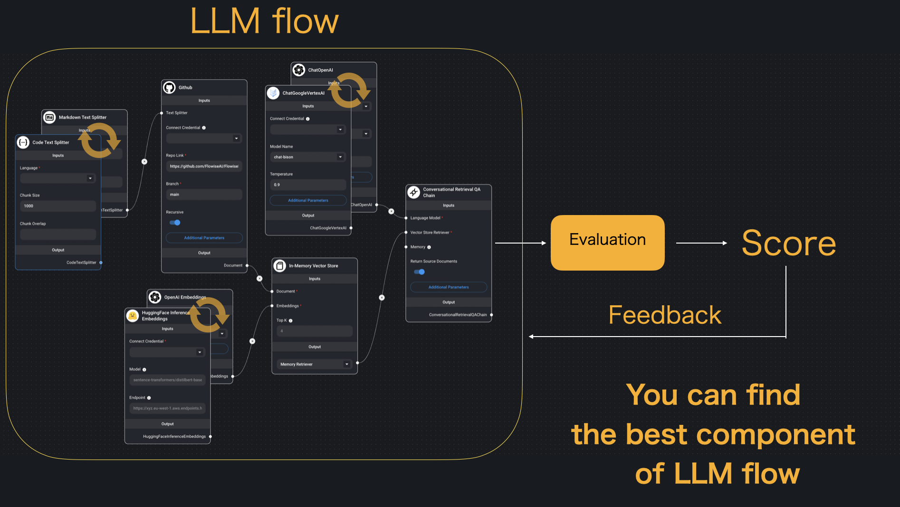

# LLMFlowOptimizer

[](https://github.com/pre-commit/pre-commit)
[](https://colab.research.google.com/github/Yongtae723/LLMFlowOptimizer/blob/main/notebooks/tutorial_notebook.ipynb)
[](https://hydra.cc/)
[](https://github.com/optuna/optuna)
[](https://black.readthedocs.io/en/stable/)
[](https://pycqa.github.io/isort/)

## 📌  Introduction

In recent years, various LLMs, embedding models, and LLM flows utilizing them have been proposed, making it difficult to manually verify which flow or component is optimal.

This repository aims to treat LLMs and Embeddings as a hyperparameter, with the goal of automatically searching for the optimal hyperparameter of the LLM flow.


**This image is the concept image of this repository (image is took from [Flowise](https://github.com/FlowiseAI/Flowise) and slightly modified). Component of LangChain like a LLM or Embedding can be treated as hyperparameter. You will find component from various candidate that can optimize score.**

This repository is strongly inspired by [lightning-hydra-template](https://github.com/ashleve/lightning-hydra-template)🎉

Any feedback, bug reports, and suggestions are appreciated!

## 🔧  Main Technologies

- [Hydra](https://github.com/facebookresearch/hydra) : Hydra is an open-source Python framework that simplifies the development of research and other complex applications. It has the ability to dynamically create a hierarchical configuration system, which is its key feature

- [Optuna](https://github.com/optuna/optuna) : Optuna is an open-source Python library for hyperparameter optimization. It offers a define-by-run API that allows users to construct search spaces, a mixture of efficient searching, and pruning algorithm to enhance the cost-effectiveness of optimization. Optuna also provides a web dashboard for visualization and evaluation of studies in real-time.

# 🚀 How to use

I will explain how to use this repository by using question answering as an example. In this example, we will use following technologies.

- [LangChain for model](https://github.com/langchain-ai/langchain) : LangChain is a framework for developing applications powered by large language models. It can be divided conceptually into components (like llm component, embedding component), which are well-abstracted and easy to switch. This is the reason we can treat each component as hyperparameter.

- [ragas for scoring](https://github.com/explodinggradients/ragas) : Ragas is an evaluation framework for Retrieval Augmented Generation (RAG) pipelines that provides tools based on the latest research for evaluating LLM-generated text to give insights about the RAG pipeline.

[](https://colab.research.google.com/github/Yongtae723/LLMFlowOptimizer/blob/main/notebooks/tutorial_notebook.ipynb)

You can experience quick start by above colab notebook.

## Step 0 : Environment Setup

Please click [<kbd>Use this template</kbd>](https://github.com/Yongtae723/LLMFlowOptimizer/generate) to use this repository as template.

- Clone your repository and install dependencies by following command.

  ```bash
  git clone git@github.com:<YOUR_GITHUB_ID>/<YOUR_REPOSITORY_NAME>.git
  cd <YOUR_REPOSITORY_NAME>
  ```

- We use poetry for package management. you can install poetry and python packages by following command.

  ```bash
  pip install poetry
  poetry install
  ```

- Rename `.env.example` to `.env` and set your environment variables to use external API like OpenAI ChatGPT.

## Step 1 : Define model architect and config.

1. Define model architect like [llmflowoptimizer/component/model/sample_qa.py](llmflowoptimizer/component/model/sample_qa.py).

   The arguments in `__init__()` can be used as hyperparameter and will be able to be optimized.

2. Define model config on [configs/model](configs/model) like example.

   Example model config:

   ```yaml
    defaults:
      - _self_
      - embedding: OpenAI
      - text_splitter: RecursiveCharacter
      - llm: OpenAI
    _target_: llmflowoptimizer.component.model.sample_qa.SampleQA # what we defined on llmflowoptimizer/component/model/sample_qa.py
    data_path: ${paths.reference_data_dir}/nyc_wikipedia.txt
   ```

3. Then you can check your model and config by following command.

   ```bash
   poetry run python llmflowoptimizer/run.py extras.evaluation=false
   ```

## Step 2 : Prepare dataset and define evaluation system

- Define evaluation system like [llmflowoptimizer/model/evaluation.py](llmflowoptimizer/model/evaluation.py), and set argument on [configs/evaluation](configs/model).

  Optuna will optimize component based on the return value of this evaluation system.

- You can check your evaluation system by following command.

  ```bash
  poetry run python llmflowoptimizer/run.py
  ```

- Since we use Hydra, you can change each LLM flow component by command line argument. For more detail, please check [Override](#override) section.

## Step 3 : Hyperparameter search

- Define search requirement on [configs/hparams_search](configs/hparams_search) like example.

  ```yaml
  model/text_splitter: choice(RecursiveCharacter, CharacterTextSplitter)
  model.text_splitter.chunk_size: range(500, 1500, 100)
  model/llm: choice(OpenAI, GPTTurbo, GPT4)
  ```

  This example if a part of [configs/hparams_search/optuna.yaml](configs/hparams_search/optuna.yaml), and it means this system will search best hyperparameter from `RecursiveCharacter` or `CharacterTextSplitter` for `model.text_splitter` component, chunk_size is between 500 and 1500, and `OpenAI`, `GPTTurbo`, `GPT4` for `model.llm` component.

  Also complicated search range can be defined by python like [configs/hparams_search/custom-search-space-objective.py](configs/hparams_search/custom-search-space-objective.py)

- You can start hyperparameter search by following command.

  ```bash
  poetry run python llmflowoptimizer/run.py hparams_search=optuna
  ```

Then you can see the best parameter on `logs/{task_name}/multirruns/{timestamp}/optimization_results.yaml`.

# 📚 Appendix

## override

You can modify components simply by adding commands, without needing to alter the code.

### override single parameter

When you want to change single parameter, you have to use `.` between parameter name.
Example:

```bash
poetry run python llmflowoptimizer/run.py model.text_splitter.chunk_size=1000
```

By doing this, you change `model_name` parameter of `llm_for_answer` to gpt-4.

### override component parameter

when you want to change parameter in component scale, you have to define component in the same folder use `/` between parameter name and value.

```bash
poetry run python llmflowoptimizer/run.py model/llm_for_answer=OpenAI
```

By doing this, LLM flow use [`OpenAI.yaml`](configs/model/llm_for_answer/OpenAI.yaml) model instead of [`ChatOpenAI.yaml`](configs/model/llm_for_answer/GPT4.yaml) model.

### Experiment config

you can also save experimental config on [configs/experiment](configs/experiment).

after you save config [configs/experiment](configs/experiment), you can override like below.

```bash
poetry run python llmflowoptimizer/run.py experiment=example
```

## Test

Before you make PR, you have to test your code by following command.
In sample test, we only check model and evaluation class can be initialized.

```bash
make test
```

## Auto code formatting

If you want auto code formatting, you can install by

```bash
make fix-lint-install
```

Then code format will be fixed automatically when you commit.

Also you can format code manually by

```bash
make fix-lint
```

<br>
<br>
<br>
<br>

**DELETE EVERYTHING ABOVE FOR YOUR PROJECT**

______________________________________________________________________

<div align="center">

# Your Project Name

[](https://github.com/pre-commit/pre-commit)
[](https://hydra.cc/)
[](https://github.com/optuna/optuna)
[](https://black.readthedocs.io/en/stable/)
[](https://pycqa.github.io/isort/)
<a href="https://github.com/Yongtae723/LLM-Flow-Optimizer"></a><br>

</div>

## Description

What it does and what the purpose of the project is.

## Installation

How to install the project.

## How to run

How to run the project.
